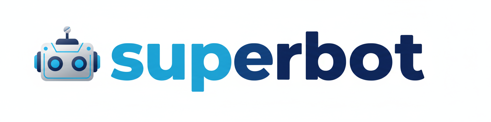
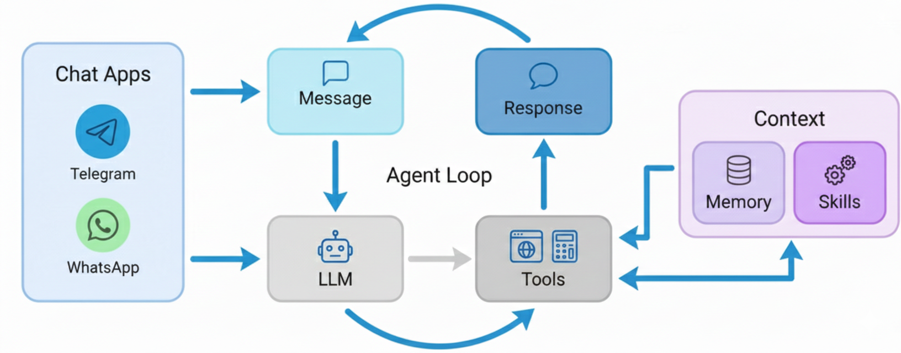

<div align="center">
  
  <h1>Superbot: Ultra-Lightweight Personal AI Assistant</h1>
  <p>
    
    
    <a href="https://discord.gg/Br4znjp5jV"></a>
  </p>
</div>

🐈 **Superbot** is an **ultra-lightweight** personal AI assistant inspired by [Clawdbot](https://github.com/openclaw/openclaw) 

⚡️ Delivers core agent functionality in just **~4,400** lines of code — **99% smaller** than Clawdbot's 430k+ lines.

## 📢 News

- **2026-02-05** 🎉 Superbot launched! Welcome to try 🐈 Superbot

## Key Features of Superbot:

🪶 **Ultra-Lightweight**: Just ~4,400 lines of code — 99% smaller than Clawdbot - core functionality.

🔬 **Research-Ready**: Clean, readable code that's easy to understand, modify, and extend for research.

⚡️ **Lightning Fast**: Minimal footprint means faster startup, lower resource usage, and quicker iterations.

💎 **Easy-to-Use**: One-click to depoly and you're ready to go.


## 🏗️ Architecture

<p align="center">
  
</p>

## Use cases

## ✨ Features


## Features

- **Agent Loop** - Core processing engine with tool-calling support
- **LLM Provider** - OpenAI-compatible (OpenRouter, OpenAI, etc.)
- **Tools** - Filesystem, shell, web search/fetch, messaging, subagents
- **Channels** - Telegram and WhatsApp integration
- **Memory** - Persistent memory and daily notes
- **Skills** - Extensible skill system with availability checking
- **Cron** - Scheduled task execution
- **Heartbeat** - Periodic agent wake-up for background tasks
- **HTTP API** - Express server with REST endpoints
- **CLI** - Command-line interface for direct interaction

## 📦 Install

**Install from source** (latest features, recommended for development)

```bash
git clone https://github.com/javimosch/superbot.git
cd superbot
npm install
```

**Install with npm** (stable)

```bash
npm install -g superbot
```

## 🚀 Quick Start

> [!TIP]
> Set your API key in `~/.superbot/config.json` or `.env`.
> Get API keys: [OpenRouter](https://openrouter.ai/keys) (LLM) · [Brave Search](https://brave.com/search/api/) (optional, for web search)

**1. Initialize**

```bash
superbot onboard
```

**2. Configure** (`~/.superbot/config.json`)

```json
{
  "provider": {
    "apiKey": "sk-or-v1-xxx",
    "apiBase": "https://openrouter.ai/api/v1",
    "defaultModel": "anthropic/claude-sonnet-4-20250514"
  },
  "web": {
    "braveApiKey": "BSA-xxx"
  }
}
```

**3. Chat**

```bash
superbot agent -m "What is 2+2?"
```

That's it! You have a working AI assistant in 2 minutes.

## ⚙️ Configuration

Config file: `~/.superbot/config.json` (optional, overrides defaults)

```json
{
  "provider": {
    "apiKey": "sk-or-v1-xxx",
    "apiBase": "https://openrouter.ai/api/v1",
    "defaultModel": "anthropic/claude-sonnet-4-20250514"
  },
  "telegram": {
    "enabled": true,
    "token": "YOUR_BOT_TOKEN"
  },
  "web": {
    "braveApiKey": "BSA-xxx"
  }
}
```

Or use environment variables (`.env` file):

| Variable | Description | Default |
|----------|-------------|---------|
| `OPENAI_API_KEY` | LLM API key (required) | - |
| `OPENAI_API_BASE` | API base URL | `https://openrouter.ai/api/v1` |
| `DEFAULT_MODEL` | Default model | `anthropic/claude-sonnet-4-20250514` |
| `WORKSPACE_PATH` | Workspace path | `~/.superbot/workspace` |
| `PORT` | HTTP server port | `3000` |
| `TELEGRAM_ENABLED` | Enable Telegram | `false` |
| `TELEGRAM_BOT_TOKEN` | Telegram bot token | - |
| `WHATSAPP_ENABLED` | Enable WhatsApp | `false` |
| `WHATSAPP_BRIDGE_PORT` | Bridge WebSocket port | `3001` |
| `HEARTBEAT_ENABLED` | Enable heartbeat | `true` |
| `HEARTBEAT_INTERVAL_S` | Heartbeat interval | `1800` |

## 💬 Chat Apps

Talk to your superbot through Telegram or WhatsApp — anytime, anywhere.

| Channel | Setup |
|---------|-------|
| **Telegram** | Easy (just a token) |
| **WhatsApp** | Medium (scan QR) |

<details>
<summary><b>Telegram</b> (Recommended)</summary>

**1. Create a bot**
- Open Telegram, search `@BotFather` 
- Send `/newbot`, follow prompts
- Copy the token

**2. Configure** (`~/.superbot/config.json`)

```json
{
  "telegram": {
    "enabled": true,
    "token": "YOUR_BOT_TOKEN"
  }
}
```

**3. Run**

```bash
npm start
```

</details>

<details>
<summary><b>WhatsApp</b></summary>

**1. Build and start bridge**

```bash
npm run bridge:build
npm run bridge:start
# Scan QR with WhatsApp → Settings → Linked Devices
```

**2. Configure** (`~/.superbot/config.json`)

```json
{
  "whatsapp": {
    "enabled": true,
    "bridgePort": 3001
  }
}
```

**3. Run**

```bash
npm start
```

</details>

## 🖥️ Local Models (vLLM)

**1. Start your vLLM server**

```bash
vllm serve meta-llama/Llama-3.1-8B-Instruct --port 8000
```

**2. Configure** (`~/.superbot/config.json`)

```json
{
  "provider": {
    "apiBase": "http://localhost:8000/v1",
    "defaultModel": "meta-llama/Llama-3.1-8B-Instruct"
  }
}
```

**3. Chat**

```bash
superbot agent -m "Hello from my local LLM!"
```

## 🐳 Docker

```bash
# Build the image
docker build -t superbot .

# Initialize config (first time only)
docker run -v ~/.superbot:/root/.superbot --rm superbot onboard

# Edit config on host
vim ~/.superbot/config.json

# Run gateway
docker run -v ~/.superbot:/root/.superbot -p 3000:3000 superbot

# Or run a single command
docker run -v ~/.superbot:/root/.superbot --rm superbot agent -m "Hello!"
```

## CLI Reference

| Command | Description |
|---------|-------------|
| `superbot onboard` | Initialize config & workspace |
| `superbot agent -m "..."` | Chat with the agent |
| `superbot agent` | Interactive chat mode |
| `superbot start` | Start the server |
| `superbot channels status` | Show channel status |
| `superbot cron list` | List scheduled jobs |

## API Endpoints

| Method | Endpoint | Description |
|--------|----------|-------------|
| GET | `/health` | Health check |
| POST | `/api/agent/message` | Send message to agent |
| GET | `/api/agent/sessions` | List sessions |
| DELETE | `/api/agent/sessions/:key` | Delete session |
| GET | `/api/channels/status` | Channel status |
| GET | `/admin` | Admin dashboard (basic auth) |

## Project Structure

```
superbot/
├── server.js           # Express server entry
├── cli.js              # CLI entry
├── config/             # Configuration
├── routes/             # Express routes
├── views/              # EJS templates
├── public/             # Static assets
├── bridge/             # WhatsApp bridge (TypeScript)
├── src/
│   ├── agent/          # Agent loop, context, memory, skills
│   ├── bus/            # Message bus
│   ├── channels/       # Telegram, WhatsApp
│   ├── providers/      # LLM providers
│   ├── services/       # Service orchestration
│   ├── session/        # Session management
│   ├── tools/          # Agent tools
│   └── utils/          # Utilities
└── docs/               # Documentation
```

## Workspace Structure

```
~/.superbot/workspace/
├── AGENTS.md           # Agent instructions
├── SOUL.md             # Personality
├── USER.md             # User context
├── HEARTBEAT.md        # Heartbeat tasks (optional)
├── memory/
│   ├── MEMORY.md       # Long-term memory
│   └── YYYY-MM-DD.md   # Daily notes
├── skills/             # Custom skills
├── sessions/           # Conversation sessions (JSONL)
└── cron/               # Cron job storage
```

## WhatsApp Bridge

The WhatsApp bridge is a TypeScript project using Baileys:

```bash
# Build and start the bridge
npm run bridge:build
npm run bridge:start
```

On first run, scan the QR code with WhatsApp to authenticate.

## Development

```bash
# Start with nodemon
npm run dev

# Run tests
npm test
```

## 🤝 Contribute & Roadmap

PRs welcome! The codebase is intentionally small and readable. 🤗

**Roadmap** — Pick an item and [open a PR](https://github.com/javimosch/superbot/pulls)!

- [x] **Voice Transcription** — Support for Groq Whisper (Issue #13)
- [ ] **Multi-modal** — See and hear (images, voice, video)
- [ ] **Long-term memory** — Never forget important context
- [ ] **Better reasoning** — Multi-step planning and reflection
- [ ] **More integrations** — Discord, Slack, email, calendar
- [ ] **Self-improvement** — Learn from feedback and mistakes

### Contributors

<a href="https://github.com/javimosch/superbot/graphs/contributors">
  
</a>

## License

MIT

## ⭐ Star History

[](https://www.star-history.com/#javimosch/superbot&type=date&legend=top-left)

<p align="center">
  <em> Created by <a href="https://intrane.fr">Javier Leandro Arancibia</a></em><br>
  <em> Thanks for visiting ✨ Superbot!</em><br><br>
  
</p>
